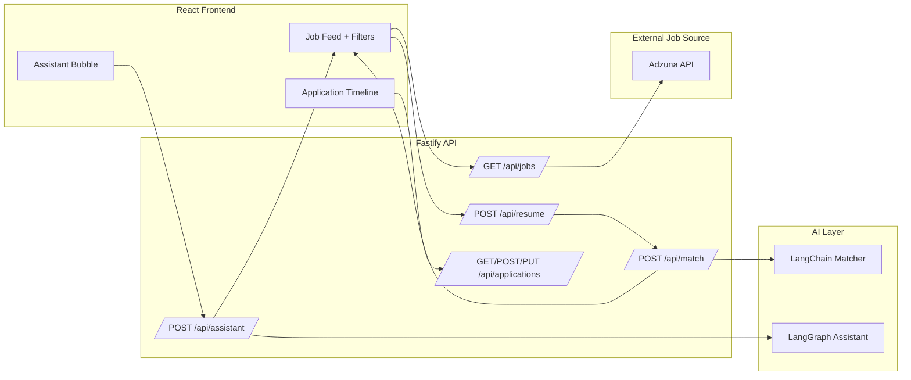

# AI-Powered Job Tracker

React frontend + Fastify backend for AI-assisted job discovery, matching, and application tracking. LangChain powers the scoring model and LangGraph orchestrates the assistant flow.

## Architecture Diagram

## Setup
### Prerequisites
- Node.js 18+
- OpenAI API key

### Install
1. Copy backend env file:
    - `apps/backend/.env.example` to `apps/backend/.env`
2. Install dependencies:
    - `npm install`

### Run (dev)
- Backend: `npm run dev:backend`
- Frontend: `npm run dev:frontend`

Backend runs on `http://localhost:4000` and frontend on `http://localhost:5173`.

## Environment Variables
Set in `apps/backend/.env`:
- `OPENAI_API_KEY`
- `OPENAI_MODEL` (optional)
- `ADZUNA_APP_ID` (optional)
- `ADZUNA_APP_KEY` (optional)
- `ADZUNA_COUNTRY` (optional)

## LangChain Usage
LangChain runs the job matching model in the backend and returns a compact JSON payload:
- `matchScore` (0–100)
- `matchedSkills`
- `relevantExperience`
- `keywordAlignment`

Prompt design keeps responses short to reduce latency since scoring runs per job.

## LangGraph Structure
LangGraph orchestrates the assistant with five nodes:
1. **Intent Detection**: classifies `search`, `update_filters`, or `help`.
2. **Action Router**: routes the flow based on intent.
3. **Job Search**: searches the in-memory job list and returns top results.
4. **UI Filter Update Tool**: emits filter changes consumed by the frontend.
5. **Product Help**: answers product questions.

State management uses a short in-memory conversation buffer keyed by `sessionId`.

## AI Matching Logic
1. Resume text is extracted from PDF or TXT.
2. Each job is scored independently using LangChain.
3. Scores and explanations are stored in memory and displayed per job.
4. Best matches are derived by sorting jobs by `matchScore` and returning the top 6–8.

Performance considerations:
- Matching uses a compact prompt and a low temperature.
- Avoids multi-step chains to keep per-job cost low.

## UX Popup Flow (Smart Application Tracking)
Design decisions:
- The Apply action opens a new tab and defers tracking until the user returns, reducing friction.
- The modal only appears after focus returns and avoids interrupting the job search flow.

Edge cases handled:
- If the user already tracked the job, the prompt is dismissed.
- Status updates can move from Applied to Interview to Offer or Rejected.

Alternative considered:
- Inline status picker on the card was rejected to avoid cluttering the feed.

## AI Assistant UI Choice
**Floating bubble** was chosen to keep filters visible and avoid shrinking the feed on smaller screens.
The assistant expands on demand and stays accessible without disrupting reading flow.

## Scalability
- **100+ jobs**: pagination and caching should be added to reduce repeated scoring.
- **10,000 users**: replace in-memory storage with a database, add auth, and introduce background queues for scoring.

## Tradeoffs
- In-memory storage resets on restart and does not support multi-user sessions.
- Job matching runs per job; for large feeds, use batching or precomputed embeddings.
- Assistant memory is ephemeral; persistent context requires storage.

## Deliverables Checklist
- Live URL: TODO (add your Vercel frontend URL)
- Backend URL: https://ai-job-tracker1.onrender.com
- Public GitHub repo: TODO (add your repo link)

## Deployment (Vercel + Render)
### Backend (Render)
1. Create a new **Web Service** from this repo.
2. Set **Root Directory** to `apps/backend`.
3. Build command: `npm install`
4. Start command: `npm run start`
5. Add env vars: `OPENAI_API_KEY`, `OPENAI_MODEL`, `ADZUNA_APP_ID`, `ADZUNA_APP_KEY`, `ADZUNA_COUNTRY`.
6. Deploy and copy the Render URL.

### Frontend (Vercel)
1. Import this repo into Vercel.
2. Set **Install Command** to `npm install`.
3. Set **Build Command** to `npm --workspace apps/frontend run build`.
4. Set **Output Directory** to `apps/frontend/dist`.
5. Set env var `VITE_API_BASE` to your Render backend URL.
6. Update `vercel.json` and replace `YOUR_RENDER_BACKEND_URL` with your backend URL.
7. Deploy.

## Notes
- Adzuna is optional; set keys to enable live fetch.
- Replace in-memory storage with a database for durability and scale.
